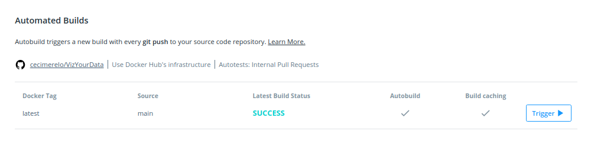

## Configuración automática del contenedor en Docker Hub

Simplemente lo he configurado en la pestaña de "Builds" de Docker Hub de la siguiente manera: 

De esta forma cada vez que haga "merge" de código sobre main se activará la construcción.
