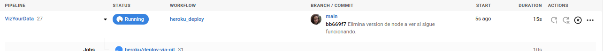
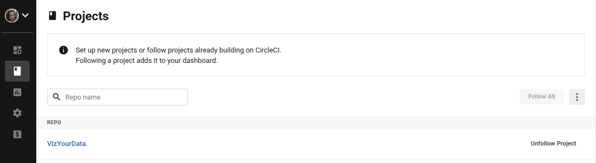

## Configuración para despliegue automático

Para el despliegue automático decidí usar [CircleCi](https://circleci.com/).

### Fichero de configuración

Circle CI precisa de un fichero de configuración en el que se establezca los trabajamos que vamos a lanzar en el proyecto.
El formato de este fichero es `.yml`, por lo que su uso es muy parecido al de las Github Actions. En nuestro caso, 
queremos usar Circle Ci para automatizar el despliegue en heroku desde Github. Entonces añadimos al fichero:

```yaml
jobs:
      - heroku/deploy-via-git
```

Esto hará que cada vez que hagamos un push al repo de github se active el despliegue:


Y en Circle CI se iniciará un workflow:



También hemos definido 1 `orb` (paquetes reutilizables de configuración YAML) para acceder a uno de los jobs que vamos a usar.
Se puede ver el archico de configuración [aquí](https://github.com/cecimerelo/VizYourData/blob/main/.circleci/config.yml)

### Configuración en Circle CI

Después de crear la cuenta en la plataforma y conectarla con github, elegimos el proyecto que vamos a usar:



Después de eso nos da la opción de añadir un fichero `config.yml` por defecto o escoger un fichero que tengamos en 
nuestro repositorio, así que elegimos el nuestro (explicado en el apartado anterior) 


