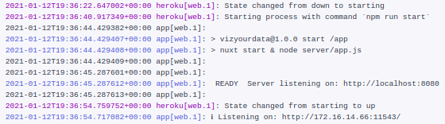

## PaaS

He usado heroku como PaaS porque ofrece la posibilidad de integrar con muchas aplicaciones. En mi caso he añadido
Papertrail que es la herramienta que elegí para el manejo de los logs. Además, el plan gratuito ofrece bastantes
horas de actividad gratis:


## Build

Una vez se empieza la construcción lo que se ejecuta es el comando `npm run build` que contiene:

```json
"build": "nuxt build"
```

Podemos verlo en el siguiente log:

```bash
       
-----> Build
       Running build
       
       > vizyourdata@1.0.0 build /tmp/build_1afcd26b
       > nuxt build
       
       ℹ Production build
       ℹ Bundling only for client side
       ℹ Target: static
       ✔ Builder initialized
       ✔ Nuxt files generated
       ℹ Compiling Client
       ✔ Client: Compiled successfully in 51.96s
Hash: da4e6349739b71340189
Version: webpack 4.45.0
Time: 51967ms
Built at: 01/11/2021 3:21:32 PM
                          Asset       Size  Chunks                                Chunk Names
 ../server/client.manifest.json   13.1 KiB          [emitted]                     
[...]
 + 1 hidden asset
Entrypoint app = 0979d4b.js 5d24ee7.js vendors/app.8798af1.css e5ca380.js app.fa9e91d.css 462eab5.js
WARNING in asset size limit: The following asset(s) exceed the recommended size limit (244 KiB).
This can impact web performance.
Assets: 
  vendors/app.8798af1.css (275 KiB)
       ℹ Generating output directory: dist/
       ℹ Generating pages
       ✔ Generated route "/"
       ✔ Client-side fallback created: 200.html
       
-----> Caching build
       - node_modules
       
-----> Pruning devDependencies
       Skipping because NPM_CONFIG_PRODUCTION is 'false'
       
-----> Build succeeded! 
(+)
```

## Start

Una vez construida la aplicación nos queda iniciarla. Esto lo hacemos en con el comando `npm run start`. Este comando
lo que hace es lanzar:

```json
"start": "nuxt start"
```

¿Pero como sabe Heroku que ese es el comando que tiene que lanzar? Se lo indicamos a través de un fichero llamado
[Procfile](https://github.com/cecimerelo/VizYourData/blob/main/Procfile). En este fichero se debe indicar el proceso
que queremos lanzar y el comando que lo lanza, en nuestro caso:

```Procfile
web: npm run start
```

Que lanzará un proceso(_dyno_) web con el comando indicado. Podemos verlo en el log siguiente:



Los procesos del Procfile se detectan durante la construcción como podemos ver en el siguiente log:

```bash
(+)
-----> Build succeeded!
-----> Discovering process types
       Procfile declares types -> web
-----> Compressing...
       Done: 121.1M
-----> Launching...
       Released v34
       https://viz-your-data-prod.herokuapp.com/ deployed to Heroku
```

> La aplicación se puede visitar en: https://viz-your-data-prod.herokuapp.com/

