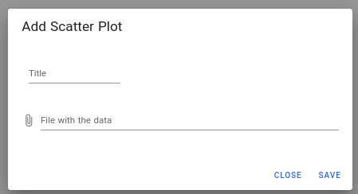
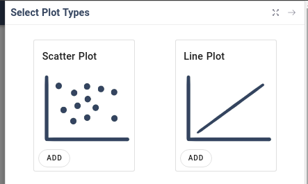

## GET Plot fields

```node
routes.get('/definitions/:plotType', getPlotFields);
```

Con este endpoint lo que queremos es que a cada tipo de gráfica se le pueda especificar 
los campos que habrá que rellenar obligatoriamente para poder construirla correctamente. En el
caso de que no se le pasara ningún parámetro se devolvería error `400`:

```node
if(!plotType.length ){
    return next(new errors.BadRequestError())
}
```

Esta función será llamada cuando le demos al botón add que aparece en la "card" de cada función definida,
y nos dará los campos que tendremos que rellenar en el form que aparece:



El input para ficheros aparecerá para todos los tipos de gráficas, a medida que vayamos
avanzando con el proyecto podremos especificar campos para cada tipo de gráfica.

## GET Plot Types

Esta función nos devolverá los tipos de funciones que tengamos definidas en el fichero `plotTypes.json`.

```node
routes.get('/plotTypes', getPlotTypes);
```

Esta función se llamará cuando le demos al botón de añadir de la página de inicio, y se mostrarán
tantas cards como tipos de gráficas tengamos definidas.La llamada a la función nos devuelve :

```json
[
    {
        "key": "scatterPlot",
        "type": "Scatter Plot"
    },
    {
        "key": "linePlot",
        "type": "Line Plot"
    }
]
```

Por tanto la UI renderizará lo siguiente:

