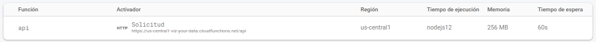

## Firebase

> Los cambios referentes a este apartado están en el PR: https://github.com/cecimerelo/VizYourData/pull/37

Firebase se usará para alojar las funciones que vayamos desarrollando. Por ahora hemos desarrollado una función del tipo
`GET`:

```
GET https://us-central1-viz-your-data.cloudfunctions.net/api/plotTypes
Content-Type: application/json
```

Esta función te devuelve los tipos de gráficas que tengamos definidas en
[plotTypes.json](https://github.com/cecimerelo/VizYourData/blob/main/functions/data/plotTypes.json) si no se especifica
ningún tipo en la query. Se ha añadido una [nueva](https://github.com/cecimerelo/VizYourData/blob/main/.github/workflows/firebase-functions.yml)
Github Action, para que cada vez que se cambie algo dentro de la carpeta `functions` se desplieguen todas las funciones
que haya definidas en el directorio. También podemos desplegarlas desde nuestro local usando `grunt deploy_firebase_functions`.

Una vez hemos desplegado las funciones podemos verlas en nuestra consola de Firebase: 



También podemos especificar el tipo de gráfica de la que queremos recibir la información añadiendolo a la `query`
```
GET https://us-central1-viz-your-data.cloudfunctions.net/api/plotTypes?type=scatter
Content-Type: application/json
```

### Prueba 

* Obtén todos los tipos de gráficas definidas [aquí](https://us-central1-viz-your-data.cloudfunctions.net/api/plotTypes)
* Obtén el tipo scatter [aquí](https://us-central1-viz-your-data.cloudfunctions.net/api/plotTypes?type=scatter)