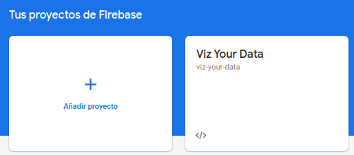
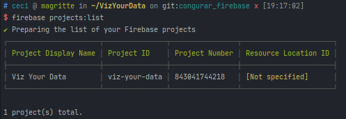
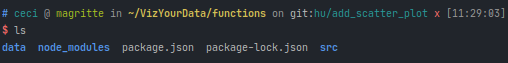

## Firebase

> Los cambios referentes a este apartado están en el PR: https://github.com/cecimerelo/VizYourData/pull/37

### Configuración Firebase

Damos de alta nuestro proyecto en Firebase:



Agregar el SDK a nuestro host, con la orden `npm install firebase-admin --save`.Instalamos la CLI y 
ejecutamos `firebase init`. Entonces tendremos que seleccionar los servicios de los que queremos, en nuestro caso `functions`,
y ya estaría. Para poder hacer uso de las funciones hay que cambiar el plan de Firebase a uno de pago, pero no te cobran a no ser
que pases el límite de llamadas, que es 2M. Podemos ver que nuestro proyecto se ha configurado correctamente:



Para las funciones se nos creará un subdirectorio que contendrá sus propios paquetes: 



Una vez hemos desplegado las funciones podemos verlas en nuestra consola de Firebase: 


Para desplegarlas se ha añadido la task correspondiente en Grunt:

```
    deploy_firebase_functions: {
        cmd: 'firebase',
        args: [
            'deploy',
            '--only',
            'functions'
        ]
    },
```
### Función

La función que hemos creado lo que hace es devolvernos los tipos de gráficas que tengamos definidas en el fichero
`data/plotTypes.json`. También se puede especificar un tipo en la llamada para obtener información sobre esa únicamente.

```
app.get('/plotTypes', async (req, res) => {
    try {
        # comprobamos si se ha especificado un tipo 
        let type = req.query.type;
        let result = [];
        
        if (type) {
            # si se ha especificado un tipo que sólo nos devuelva ese
            result = data.filter(types => types.key === type);
        } else {
            # sino que nos devuelva todos los tipos definidos
            data.forEach((plotType) => {
                result.push(plotType.type);
            });
        }
        res.setHeader('Access-Control-Allow-Origin', '*');
        res.status(200).send(result);
    }catch (error) {
        res.status(500).send(error);
    }
});
```

### Uso

Para obtener todas las gráficas definidas hacemos una llamada del tipo:
```
GET https://us-central1-viz-your-data.cloudfunctions.net/api/plotTypes
Content-Type: application/json
```

Si necesitamos la información sobre un tipo especifico debemos añadirlo en la query:
```
GET https://us-central1-viz-your-data.cloudfunctions.net/api/plotTypes?type=scatter
Content-Type: application/json
```

Si escribimos estas urls en el navegador podemos comprobar lo que nos devuelve.