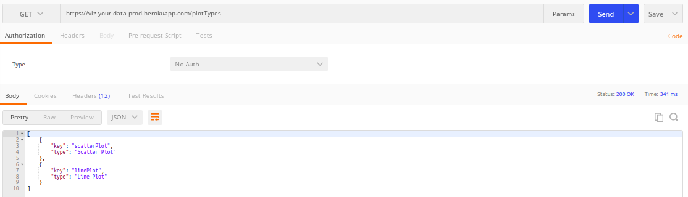
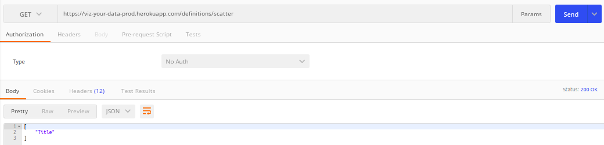
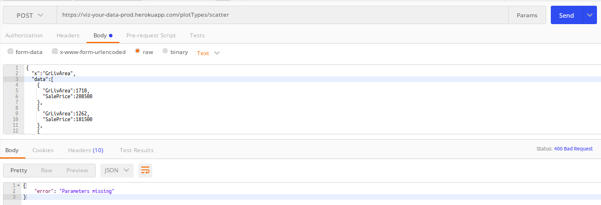
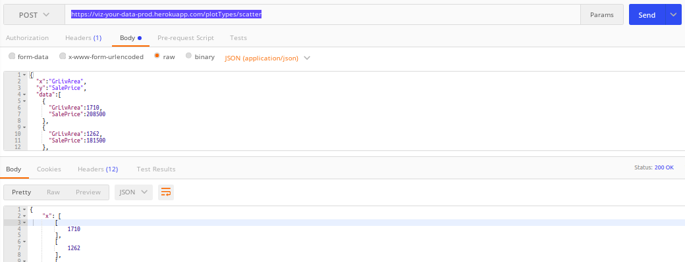

## Comprobación rutas

Vamos a probar las diferentes rutas que hemos desplegado para comprobar que funcionan correctamente, además devuelven
los status correctos. Si se ponen las urls indicadas directamente en la web se puede comprobar el funcionamiento.

### Ruta GET /plotTypes

Con la ruta : `https://viz-your-data-prod.herokuapp.com/plotTypes`:

Devuelve `status 200` además de la respuesta que esperábamos.

### Ruta GET /definitions/scatter

Ruta : `https://viz-your-data-prod.herokuapp.com/definitions/scatter`

### Ruta POST /plotTypes/scatter

En el caso de que la request esté incompleta, nos devolverá un `status 400 Bad Request: 

En el caso de que la request cumpla todas las condiciones nos devolverá `status 200 OK`:

- Ruta: `https://viz-your-data-prod.herokuapp.com/plotTypes/scatter`
- Body: se puede ver un ejemplo [aquí](tests/files/test_scatter.json)

