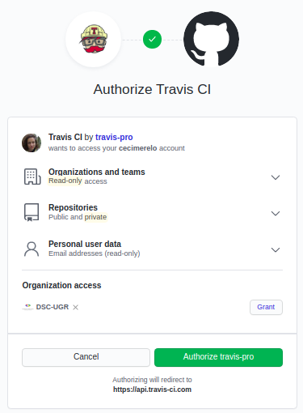
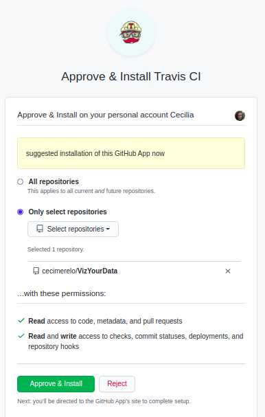
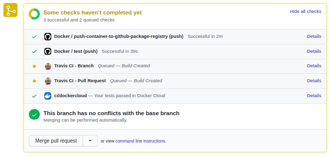
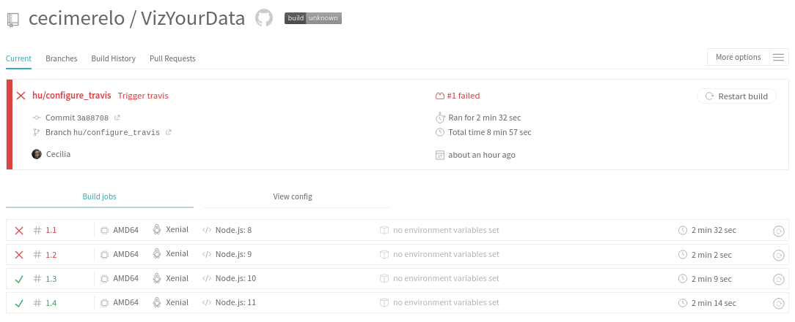
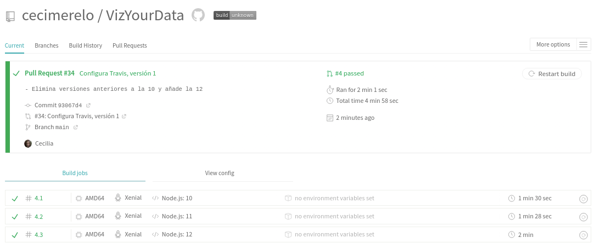

## Configuración de Travis

1. Nos damos de alta en Travis con Github:

  

2. Activamos el repositorio de nuestro proyecto para poder usarlo en Travis
  
    

3. Añadimos un fichero .travis.yml y lo subimos a Github, de esta manera le indicamos
a Travis qué hacer. Cuando hagamos push podremos ver que aparece el build de Travis:
    
    

Ahora podremos ver cómo se ha activado la construcción en Travis con todas
 las versiones que hemos indicado en el fichero de configuración:

En nuestra primera versión del fichero de configuración de Travis se ha probado con Node 8 a la 11, y han fallado
la 8 y la 9 como podemos ver en la siguiente imagen:

Entonces sabemos que dichas versiones no funcionan para nuestro proyecto así que las eliminamos. Probamos también a 
añadir la última versión de node. Con esta última configuración se ha construido correctamente :

Para ver los cambios que se han hecho en el código para configurar Travis ir [aquí](https://github.com/cecimerelo/VizYourData/pull/34/files#diff-6ac3f79fc25d95cd1e3d51da53a4b21b939437392578a35ae8cd6d5366ca5485).
