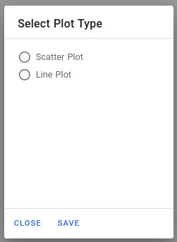

## Integración dentro del Proyecto General

Las historias de usuario correspondientes a este milestone las podemos ver [aquí](https://github.com/cecimerelo/VizYourData/issues?q=is%3Aissue+milestone%3A%22Hito+5%22+is%3Aclosed)

Se ha usado Vercel como herramienta de despliegue en producción y hosting, como hemos mencionado en la [documentación](vercel.md)
sobre esta herramienta. Y usaremos las funciones de Firebase como API, como hemos comentado en la
[documentación de Firebase](firebase.md).

Vercel hostea la app en el siguiente enlace: viz-your-data.vercel.app. Además, ahora, cada vez que pulsamos la 
opción de añadir nos aparecen opciones, y dichas opciones las pedimos a través de nuestra función de Firebase:

