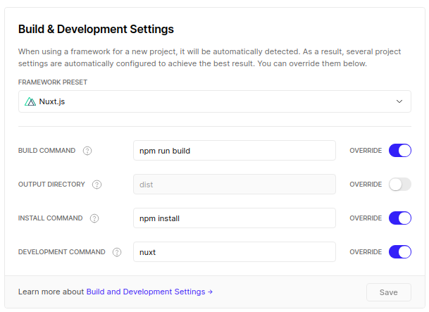
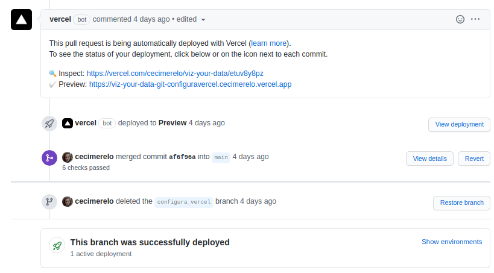

## Vercel

> PR en el que se han hecho los cambios: https://github.com/cecimerelo/VizYourData/pull/41

### Despliegue

Al conectar Vercel con el proyecto te da diferentes opciones de configuración y construcción, una
de las opciones es usar Nuxt para la construcción y el despliegue. Nuxt es el framework que estaba usando para el 
cliente así que lo configuramos como se ve en la siguiente imagen. De esta manera cada vez que haga push 
al repositorio de mi proyecto, se ejecutarán dichos comandos:

Ya tenía implementado un frontend para la app, aunque sólo la página principal. Así que he decidido usar Vercel para alojarlo, 
podemos acceder a ella en el siguiente [enlace](https://viz-your-data.cecimerelo.vercel.app/). 

### CI 
Cada vez que haga un push en el repositorio se hará el despliegue a Vercel pero el entorno de producción sólo se 
actualizará cuando se haga `push` a `main`.

