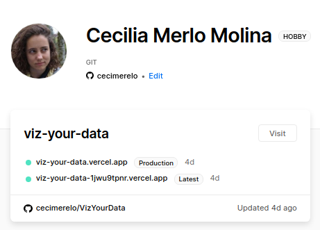
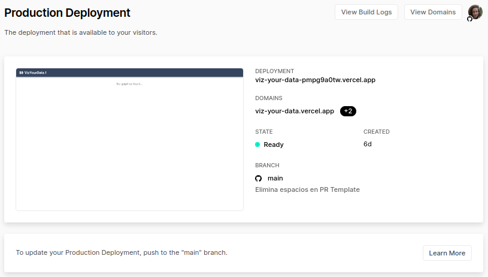
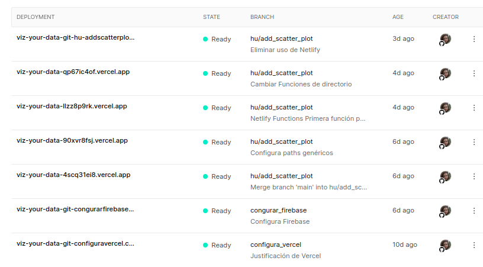

## Vercel

> PR en el que se han hecho los cambios: https://github.com/cecimerelo/VizYourData/pull/41

Mi perfil de Vercel luce de la siguiente manera: 

### Despliegue
Al conectar Vercel con tu proyecto te da diferentes opciones de configuración y construcción del proyecto, una
de las opciones es usar Nuxt para la construcción y el despliegue.  Nuxt que es el framework que estaba usando para el 
cliente del proyecto así que lo configuramos como se ve en la siguiente imagen. De esta manera cada vez que haga push 
al repositorio de mi proyecto, se ejecutarán esos comandos :

He usado Vercel como Hosting de mi aplicación, podemos acceder a ella en el siguiente [enlace](https://viz-your-data.cecimerelo.vercel.app/). 

Para poder desplegarlo, es decir, que funcionará el comando de `npm run build` he tenido que hacer algunos cambios en
la configuración de Nuxt (`nuxt.config.js`)que se pueden ver en el PR. Por ejemplo añadir Vuetify como plugin a mi 
proyecto, porque lo estaba usando pero no lo estaba compilando.

Y el estado de mi app en producción:

### CI 
Cada vez que hago un push en el repositorio aparece un mensaje indicándome si el despliegue ha tenido éxito:

Además en Vercel podemos ver un historial de las pruebas que hemos ido realizando:

Entonces cada vez que hagamos push a cualquier rama se desplegará en Vercel, pero el entorno de producción 
sólo se actualizará cuando se haga `push` a `main`.

